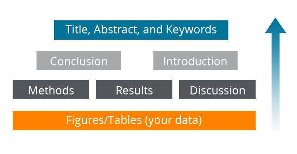

# General structure of a research article

* Title
* Abstract
* Keywords

* Introduction
* Methods
* Results and Discussion

* Conclusion
* Acknowledgements
* References
* [Supporting Materials]()

Let us look at each section and what it contains, starting with title.

*There are certain characteristics of effective titles. They should:*

1. Attract the reader's attention.
2. Contain the fewest possible words.
3. Adequately describe content.
4. Be informative but concise.
5. Identify the main issue.
6. Not use technical jargon and abbreviations, but use formal language.

It is advisable to discuss the title with your co-authors.

**Remember :** Editors and Reviewers do *NOT* like titles that make no sense or fail to represent the subject matter adequately.

And maybe even more important, you want the apporpiate audience to read your paper. If the title is not accurate, the rigt people may not read it and the community might be unaware of your work. This could even lead to *lower citations than the paper deserves*.

# Authorship 

1. Determining the order of authors on a paper can vary by discipline and culture, but the general rule is that the **first author** is the person who conducts or supervises: **the data collection, analysis, presentation, and interpretation of the results** and also puts together the paper for submission. The **corresponding author** can be the first author, or sometimes is a senior author from the institution.

2. **You should always avoid ghost authorship** which means excluding authors who participated in the work, and **gift authorship**, which means including authors who did not contribute to the work. Also, always be consistent in how you write the authors' names.


# Keywords 

1. **Keywords** are the labels or tags for your manuscript and are used by indexing and abstracting services, **Avoid** Words that have broad meaning. Keywords should be specific enough to give someone a very quick idea about the content og your paper.

2. Only use abbreviations that are firmly established in the field of study, e.g. DNA.

3. Check the[ guide for authors](https://www.elsevier.com/journals/learning-and-instruction/0959-4752/guide-for-authors) for specifics on which keywords should be used.

* Are the labels of the manuscript
* Are used by indexing and abstracting services
* Should be specific
* Should use only established abbreviations (e.g. DNA)

```{r , echo= F}
df1 <- data.frame(a = 'An experimental study on evacuated tube solar collector using supercritical CO2',
                  b = 'Solar Collector; Supercritical CO2; solar energy; solar thermal utilization')
colnames(df1) <- c('Article title', 'keywords')
knitr::kable(df1)
```

The table contains actual examples of keywords that are associated with an article taken from scienceDirect.com.

# Abstract

If the title cathces a reader's attention, the next thing they check is the **Abstract**. The Abstract is freely available in electronic abstracting and indexing services, such as Scopus, PubMed, Medline, and Embase.

1. The abstract should be a single paragraph summarizing the problem, the methods, the results and the conclusions.

2. The abstract acts as an advertisement for your article since it is freely available via online searching and indexing. You want to make it as catchy and accurate as possible to have the greatest impact.

3. An Abstract written clearly will strongly encourage the reader to read the rest of your paper.

4. The Abstract should be as brief as possible.

Take the time to write the Abstract very carefully. Many authors write the abstract last to it accurately reflects the content of the paper.

**A clear abstract will strongly influence whether or not your work is considered**


# The process of writing - bulidng the article 

The sequence of writing the article is not the same as reading it. For most scientific fields, the most efficient way is to regard the manuscript as a wall and build it brick by brick.

1. You start with producing your tables and figures, with captions/legends.

2. Then describe the *Methods* used, the *Results* found, and the Discussion around these results.

3. The conclusion should flow on from this fairly easily

4. Then you write the introduction, s to where you work fits into the field as a whole.

5. Finally, you write the Title, Abstract and Keywords.


This process of building the article is easier, more logical, and more effective than trying to write an article in the sequence it is read. 




# Introduction

The introduction is used to provide context for your manuscript and convince readers why your work advances a field of study.

1. Be concise in the introduction but give the reader enough information to understand why the work is important, Introductions of letters can be shorter, sometimes one paragraph.

  This section should not be  a history lesson but you do need to introduce the main research publications on which you work is based. Cite a couple of *original and important works* including recent review articles, to give the reader a sense of how your work fits into the literature. However, take care to not make citations to irrelevant references including your own.
  
Make sure you clearly address the following: What is the problem you are ultimately trying to solve?

Identify the solutions and limitations: Are there any solutions? If so, what us the best solution and what are its limitations? what is your work trying to achieve?

Provide a perspective that is consistent with the journal where you are submitting.

Although it can be tempting to re-use introductions from your previous papers or similar studies, every paper should present a new result and the work should be specifically motivated. This requires a unique introduction every time.

An introduction should:

* Provide a brief context to the readers
* Address the problem
* Identify the solutions and limitations
* Identify what the work is trying to achieve
* Provide a perspective consistent with the nature of the journal

# Methods

The methods section describes how you studied the problem.

It is important to be detailed - a knowledgeable reader should be able to reproduce the experiment.

Any previously published procedures should not be re-written in detail. Those can be noted in references or described in the supporting materials section.

The equipment and materials used in experiments should be identified, along with their sources if there is the chance for variability of quality of these items. If the work is computational or theoretical, code, computational, or analytical methods should be described.

A methods section should :

* Describe how the problem was studied

* Include detailed information

* Do not describe previously published procedures.

* Identify the equipment and materials used.


# Results

Moving on to the results section. This is where you describe the important results of your research.

1. You should **present the results that are essential to the discussion**, which means that only the data of primary importance should be shared. Data of secondary importance should be put in the supporting or supplementary materials section. However, do not attempt to 'hide data' in the hope of saving it for a later paper, or split the results of one project into many papers. This dilutes the effect of the work and results in lower quality papers. You may also lose evidence that re-enforces yous conclusions.

2. **Use sub-headings to keep results of the same type together**. - This will make the results easier to review an read. Number these sub-sections for the convenience of internal cross-referencing. Decide on a logical order of the data that tells a clear story.

3. Highlight findings that further understanding in the field, or those that differ from previous finding an explain any unexpected results.

Illustrations, including figures and tables, are the most efficient way to present the results. Your data are the 'driving force of the paper' Therefore your figures and illustrations are critical and they should be used for ESSENTIAL data only. The legend of a figure should be brief and it should contain sufficient explanatory details to explain the figure without the need to refer to the text. Use color ONLY when necessary. In different line styles can clarify the meaning, don use colors or other effects than can distract from the content and may not appear when printed in black and white.

A. Graphs are often used to compare experimental results with those of previous works, or with calculated/theoretical values. Graphs should not appear crowded; try to present at most 3 to 4 data sets per figure, Use well-selected scales, label the axes clearly, and use different symbols so that one can quickly discriminate between the data sets. 

B. Often, tables give the actual experimental results. Do not include long boring tables unless absolutely necessary (otherwise put them in the supplementary materials section) and make them a easy to read as possible.

C. Every photograph or image should be presented with a scale marker and the resolution should be clear.

The results section should:

*Include only data of primary importance

*Use sub-headings to keep results of the same type together

*Be clear an easy to understand

*Highlight the main findings

*Feature unexpected findings

*Provide statistical analysis

*Include illustrations and figures

*Include only data of primary importance


